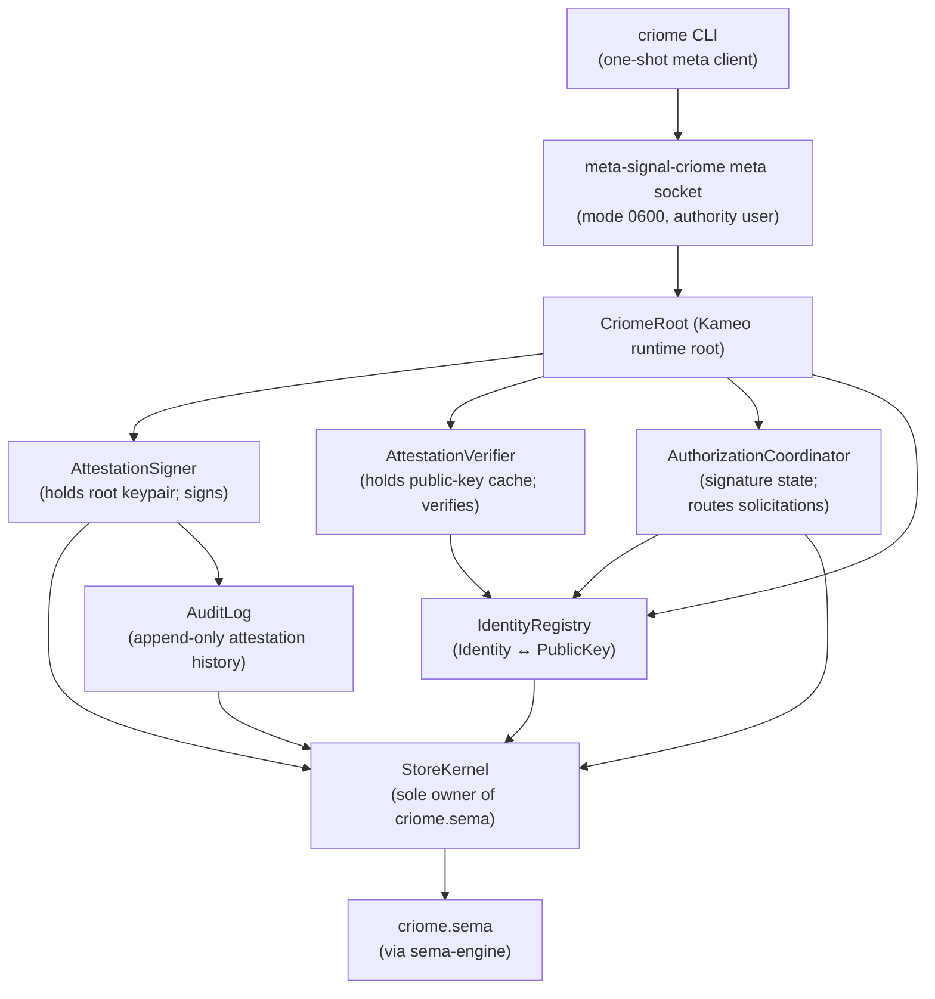

# criome — architecture

*Today's `criome` is a **minimal Spartan BLS-signature
authentication and attestation substrate** for the Persona
ecosystem. Identity registry, sign/verify primitives, and
typed attestations over channel grants, archive fingerprints,
authorization decisions, and privilege elevations.*

> **Scope: today, not eventually.** This document describes
> today's narrow `criome` daemon. The **eventual** `Criome`
> is the universal computing paradigm expressed in Sema —
> replacing Git, the editor, SSH, and the web; encompassing
> programming, version control, network identity, validation,
> and auth/security across the stack. Today's Spartan criome
> is one step toward that eventual shape, bringing forward
> the auth/identity slice. See
> `INTENT.md` §"Why this repo exists".

> **Archaeology note.** Prior to this rewrite, today's
> `criome` was the sema-ecosystem records validator
> (Graph/Node/Edge/Derivation/CompiledBinary). That skeleton
> (validator pipeline, ractor supervision tree, sema-records
> tables) is preserved at commit **`a3f4173`**
> (`architecture: reframe marker as scope discipline …`).
> The sema-records validator function is **deferred to
> eventual Criome**; today's daemon does not carry it.


## 0 · TL;DR

- **Operative principle**: **Criome verifies; Persona
  decides.** Criome answers *"is this signature valid for
  this principal under this grant for these bytes?"*
  Persona answers *"should this prompt be delivered,
  should this work be executed?"* The boundary is sharp;
  prompt-audit policy lives in `mind`, not in
  criome.
- **One Kameo-based daemon** holding criome's own root
  keypair, an identity registry, delegation grants, a
  replay-guard, and an audit event log in `criome.sema`
  through `sema-engine`.
- **First milestone is verifier-shaped.** Three primary
  capabilities: **verify** external signatures (developer
  release signatures, message signatures), **
  register/lookup** typed identities (Persona, Agent,
  Host, Developer, Cluster), **emit attestations** signed
  by criome's root key only when a witness requires (e.g.,
  ChannelGrantAttestation from `mind`).
- **Routed authorization is the Lojix integration path.**
  `lojix-daemon` submits the exact canonical `signal-lojix`
  request digest to its local `criome-daemon` and waits on the
  submit-open request stream. Criome routes signature solicitations,
  records pending/granted/denied state, checks expiry and replay, and
  issues an authorization envelope whose permission comes from
  signatures over the exact request.
  Lojix owns deployment coordination after the envelope grants the
  requested scope.
- **Signature scheme**: **BLS12-381 from day one**, via
  `blst` (Supranational). Closed `SignatureScheme` enum
  carries `Bls12_381MinPk` and `Bls12_381MinSig` variants;
  operator picks one at implementation time per `blst`
  ergonomics. Committing to BLS at milestone one keeps
  every Spartan attestation a quorum candidate without a
  future scheme migration when eventual-Criome's
  quorum-signature multi-sig lands.
- **Wire**: `signal-criome` contract crate over `signal-frame`.
  Closed `CriomeRequest` / `CriomeReply` enums. `criome` accepts one
  NOTA request and prints one NOTA reply at the CLI boundary;
  `criome-daemon` accepts one signal-encoded rkyv
  `CriomeDaemonConfiguration` file and never parses NOTA.
- **Out-of-band only.** Attestations live as separate
  records that reference content records (a
  `ChannelGrantAttestation` references a `signal-mind`
  channel-grant record). Content records
  do not carry embedded proof fields; the
  origin-context discipline ("origin context, not
  proof material") stays inviolate.
- **Cluster-trust runtime functionality is folded in.**
  ClaviFaber's per-host `PublicKeyPublication` feeds into
  criome's identity registry, registering each host.


## Authorization model

- **A criome daemon has one meta authority: a Unix user.** Only that user can
  write to the daemon's meta socket. *Single-owner* is what gives the
  daemon authority to sign with its master key. The meta contract target is
  `meta-signal-criome`; the user speaks it through the `criome` CLI
  (one-shot) or `tui-criome` (long-running interactive). The CLI is
  the first meta client to build; the TUI exists because
  escalation-to-approve flows need a client that stays interactive
  across many escalations.
- **Criome holds policy + collects signatures + issues grants.** The
  daemon's policy data names which signers / which quorum are required
  for which content-addressed request kinds. Permission for a specific
  request is constituted by *signatures over the canonical request
  digest that satisfy criome's policy* for that request. A grant for
  one request cannot authorize another.
- **Quorum-bearing signatures are stamped.** Operation evidence,
  adjudicator agreement facts, routed signature submissions, and
  authorization grants carry `StampedSignatureEnvelope`: the bare
  BLS envelope plus the crystallized-past `AttestedMoment` that places
  the signature in time. The daemon verifies the moment and binds the
  signed bytes to that stamp. `TimeSignature` stays bare because it is
  the recursive root that creates an `AttestedMoment`.
- **Authorized object updates are reference-only pulses.** A successful
  policy evaluation publishes `AuthorizedObjectUpdate`: the authorized
  object's component differentiator, digest/kind, the policy contract
  digest, the decision, and the attested moment. Criome does not carry
  object payloads; components use the digest with the routing/object-
  distribution layer. Components subscribe with `AuthorizedObjectInterest`
  for the event classes related to their function; `SubscriptionRegistry`
  filters snapshots and publications by that declared interest instead of
  criome computing a universal affected-component set. The stream token carries
  both subscriber identity and interest, so retraction closes one
  `(subscriber, interest)` observation. Socket-level `SubscriptionEvent`
  fanout is a transport follow-up.
- **Time-driven pulses are contract-programmed.** There is no ambient global
  heartbeat. Accepting a contract with an after-time condition schedules a
  later check of that contract against related events; when the crystallized
  time condition matures, criome checks whether those events happened, and if
  they did not, triggers a new acceptance for the time-based condition's
  resulting state to be quorum-signed and propagated as another reference-only
  pulse. The current POC exposes this as explicit
  `ScheduleContractTimeCheck` / `RunDueContractChecks` signal requests; a
  durable scheduler actor/table can replace the explicit trigger without
  changing the pulse shape.
- **Two policy classes are first-class:**
  - *Simple policy* — single-key self-owned. Criome holds the private
    key; only its own master-key signature is needed. The default and
    most common case.
  - *Complex policy (quorum)* — needs criome's own signature plus
    signatures from named peer criome daemons. Cross-criome routing
    solicits the additional signatures.
- **Two escalation kinds are first-class:**
  - *Escalation-to-sign* — policy is satisfied; criome signs with its
    master key and returns the grant.
  - *Escalation-to-approve* — policy says *"ask my meta authority before
    signing"*; criome routes an approval prompt to the meta authority over
    `meta-signal-criome`; the authority answers yes/no; criome then signs
    or denies.
- **The internal policy-language POC also has an explicit
  `EscalateToPsyche` outcome.** This is a contract-level decision result,
  not a daemon-side prompt mechanism: the evaluator returns that the policy
  requires psyche judgment, while the judgment and any later signed verdict
  happen outside the finite evaluator.
- **There are many criome daemons.** One per Unix user; new trust
  boundaries spawn new daemons. Complex policies that demand peer
  signatures find peers by predictable socket names (§"Peer discovery
  and cross-criome routing" below).
- **Criome-daemon's authority state.** Request state, signature
  solicitation state, submitted-signature state, grant state, expiry,
  and replay policy — all owned through sema-engine tables. Plus the
  policy table and the peer-routing table.
- **`AuthorizationGrant` carries the satisfied policy.** Scope, the
  signatures collected, and the threshold expression that says why
  those signatures are sufficient.
- **Pending authorization is pushed.** `AuthorizeSignalCall` opens a
  request-scoped lifecycle stream for the submitted request: current
  snapshot first, then pending → granted/denied/expired updates.
  `ObserveAuthorization` remains available when a caller already holds
  a slot. Lojix effects wait for `AuthorizationGranted` over the
  request's exact digest, not by polling.

## Security model — Unix-user as boundary

The security boundary criome enforces in production is the Unix-user
filesystem permission model. The meta socket is a user-owned file at
mode `0600`; only that Unix user can write to it; therefore only that
user can issue meta-class orders to the daemon.

This is a deliberate adoption of the only boundary still enforced
today. **In a world of AI agents, any process running as Unix user
X can spawn an agent that drives the screen, mouse, keyboard, and
audio of user X's session.** Reading window contents, recording the
display, capturing keystrokes, controlling the cursor — all of these
are available to any same-UID process. GUI process isolation, "this
runs in its own window so it's safe," and similar assumptions no
longer hold. What remains is the kernel-enforced file permission
model: a same-UID process can already do anything criome can do, but
a process running as a different UID cannot write criome's meta
socket regardless of what it knows.

Criome therefore rests its authority on *single Unix-user ownership*
of the daemon. Same-UID hardening — `mlock` of decrypted master-key
pages, zero-after-use of passphrase bytes, disabled core dumps,
audit-log discipline — is the rest of the in-user posture; the
filesystem boundary is the part the OS enforces for us.

**Meta-session bytes are encrypted before they carry passphrases
or meta-class traffic.** The meta socket mode `0600` is still the
load-bearing local authority boundary: a same-UID process can
already do anything criome can do, while a different-UID process
cannot write the meta socket. The encrypted meta session is
defense-in-depth for the cases where a different UID observes bytes
without owning the socket: bind-time races, runtime-directory
mistakes, symlink races, or partial-frame protocol bugs.

**`SO_PEERCRED` makes the owner boundary kernel-enforced, not
path-secrecy-only.** On every accepted meta connection the daemon
reads the peer's kernel credentials (`MetaSocketAuthority`, via
`rustix::net::sockopt::socket_peercred`) and serves only the Unix
user that owns the bound meta socket inode; any other UID is refused
before the first meta request is read. This closes exactly the gaps
the `0600` mode alone cannot: if the socket mode is ever loosened, or
a bind-time / runtime-directory / symlink race exposes the socket to
a different UID, the kernel-supplied peer UID still gates the policy
plane. A refused peer is logged and dropped without stopping the
serve loop, so a non-owner cannot wedge the daemon by dialling the
meta socket.

The `meta-signal-criome` session starts with an ECDH exchange, derives
a symmetric session key through HKDF, then carries AEAD-encrypted
frames. The exact cipher suite belongs to the `meta-signal-criome`
contract pass; candidates are Noise XX or a direct X25519 +
HKDF-blake3 + ChaCha20-Poly1305 / AES-GCM shape. The passphrase may
be plaintext *inside* the encrypted session; it must not be exposed
as plaintext socket traffic.

**Cross-host transport is a separate case.** Peer criome daemons on
different hosts speak across the local boundary. Cross-host
signal-criome links need wire crypto (TLS, signed envelopes, or
SSH tunnelling); the local-trust argument does not extend to the
network. See §"Peer discovery and cross-criome routing" for the
open design slot.

## 1 · Topology



Direct Kameo per `~/primary/skills/kameo.md`. `Self IS the
actor` everywhere. Blocking BLS operations (keypair load,
sign, verify) live in `AttestationSigner` /
`AttestationVerifier` via `DelegatedReply` + `spawn_blocking`
(Template 1 in `~/primary/skills/kameo.md` §"Blocking-plane
templates"), or on a dedicated thread (Template 2) when the
work is hot enough.


## 2 · Owned

- The `criome.sema` durable store and its component-local
  Sema layer.
- **The single Unix-user meta authority relation.** The daemon's meta
  socket lives at a per-user path with mode 0600; only that user
  can write to it. The `meta-signal-criome` contract is the
  surface between the authority (their CLI / TUI) and the daemon.
- **The daemon's master BLS keypair as its core identity.**
  Loaded at startup; private half may be encrypted at rest using
  the authority's passphrase (submitted over `meta-signal-criome` at
  startup); decrypted master-key pages are `mlock`ed and zeroed
  on shutdown.
- The closed `Identity` enum vocabulary: `Persona`,
  `Agent`, `Host`, `Developer`, `Cluster`.
- The signing/verification API surface against `blst`.
- The attestation audit log (append-only,
  cryptographically witnessed).
- The `criome.pub` public-material publication for
  consumers to verify criome-issued attestations.
- **The policy table.** Maps content-addressed request kinds to
  one of two policy classes: *simple* (single-key self-owned) or
  *complex* (quorum across criome's own key plus named peers).
  Today's two classes are the immediate need; richer schema
  (action-pattern granularity, weighted thresholds, subkeys)
  lives in §"Future possibilities".
- **The peer-routing table.** Maps peer master public keys to
  `(host, unix-user)` pairs for cross-criome solicitation under
  complex policies.
- Authorization request state, signature solicitation state,
  submitted signature state, authorization envelope issuance,
  authorization expiry, and replay policy. Permission is
  constituted by signatures over the exact request digest that
  satisfy criome's policy.

## 3 · Not owned

- Content records (`ChannelGrant`,
  `AuthorizationRequest`, `ArchiveAttestation`'s referent
  hash, `PrivilegeElevationRequest`) — those live in their
  respective signal contract crates.
- Per-persona / per-agent / per-developer private
  keypairs — criome holds only the *public* halves.
- Audit-policy decisions about prompt safety — the
  audit-policy engine is a separate component to
  be designed in a follow-up report. Criome signs the
  *verdict*; the policy engine produces the verdict.
- Sema-ecosystem records validation (Graph/Node/Edge/
  Derivation/CompiledBinary) — deferred to eventual
  Criome.
- Effect-bearing dispatch (forge, arca-daemon, prism) —
  these belonged to the prior records-validator framing;
  they leave today's criome's surface.
- Key rotation orchestration — out of scope for the
  Spartan first cut.


## 4 · Wire vocabulary

The contract crate is `signal-criome` (separate repo, see
its own `ARCHITECTURE.md` when created). Closed enums:

```text
CriomeRequest
  | Sign(SignRequest)
  | VerifyAttestation(VerifyRequest)
  | RegisterIdentity(IdentityRegistration)
  | RevokeIdentity(IdentityRevocation)
  | LookupIdentity(IdentityLookup)
  | AttestArchive(ArchiveAttestationRequest)
  | AttestChannelGrant(ChannelGrantAttestationRequest)
  | AttestAuthorization(AuthorizationAttestationRequest)
  | AuthorizeSignalCall(SignalCallAuthorization)
  | ObserveAuthorization(AuthorizationObservation)
  | ObserveParkedAuthorizations(ParkedAuthorizationObservation)
  | VerifyAuthorization(AuthorizationVerification)
  | RouteSignatureRequest(SignatureSolicitationRoute)
  | SubmitSignature(SignatureSubmission)
  | RejectAuthorization(AuthorizationRejection)
  | SubscribeIdentityUpdates(IdentitySubscription)
  | IdentitySubscriptionRetraction(IdentitySubscriptionToken)
  | AuthorizationObservationRetraction(AuthorizationObservationToken)

CriomeReply
  | SignReceipt(SignReceipt)
  | VerificationResult(VerificationResult)
  | IdentityReceipt(IdentityReceipt)
  | IdentitySnapshot(IdentitySnapshot)
  | AttestationReceipt(AttestationReceipt)
  | AuthorizationPending(AuthorizationPending)
  | AuthorizationGranted(AuthorizationGrant)
  | AuthorizationDenied(AuthorizationDenied)
  | AuthorizationExpired(AuthorizationExpired)
  | AuthorizationUnavailable(AuthorizationUnavailable)
  | AuthorizationObservationSnapshot(AuthorizationObservationSnapshot)
  | ParkedAuthorizationSnapshot(ParkedAuthorizationSnapshot)
  | SignatureRouteReceipt(SignatureRouteReceipt)
  | SignatureSubmissionReceipt(SignatureSubmissionReceipt)
  | AuthorizationObservationRetracted(AuthorizationObservationRetracted)
  | SubscriptionRetracted(SubscriptionRetracted)
  | IdentityUpdate(IdentityUpdate)
  | Rejection(Rejection)
```


## 5 · State and ownership

Single component store file (`criome.sema`), opened only by
`StoreKernel`. Durable families are registered through
`sema-engine` with per-family schema hashes:

| Family | Key | Value |
|---|---|---|
| `criome-identity` | typed identity key | `StoredIdentity` with public key, fingerprint, purpose, status |
| `criome-revocation` | typed identity key | `StoredRevocation` |
| `criome-attestation` | monotonic slot | `StoredAttestation` |
| `criome-authorization-state` | typed authorization request slot | pending/granted/denied authorization state |
| `criome-authorization-replay-nonce` | requester + nonce | replay guard for authorization requests |
| `criome-signature-solicitation` | typed authorization request slot + signer | in-flight routed signature work |
| `criome-submitted-signature` | typed authorization request slot + signer | signatures submitted by the owner or peer criome daemons |
| `criome-attestation-slot` | fixed counter key | next attestation slot |
| `criome-authorization-slot` | fixed counter key | next authorization request slot |
| Sema meta | Sema-owned | schema-version and rkyv-format guards |

The version-skew guard runs at boot and hard-fails on
mismatch (per
`~/primary/skills/rust/storage-and-wire.md` §"Schema discipline").


## 6 · Trust model and key distribution

- Criome's master public key is materialized to a known per-user
  path (e.g., `${XDG_RUNTIME_DIR}/criome/<short-hash>.pub`,
  mirrored at a stable per-user well-known location). Local
  consumers read this file at startup to bootstrap signature
  verification against the criome they trust.
- Criome's master private key is loaded at startup. If the
  private half is encrypted at rest, the daemon waits for the
  meta authority to submit the passphrase over `meta-signal-criome` before
  the master-key actor reports ready. Meta-session frames are
  encrypted with an ECDH-derived symmetric key before any
  passphrase or meta-class operation travels. Standard hardening
  — `mlock`, zero-after-use, disabled core dumps — applies
  regardless.
- Per-persona / per-agent / per-developer / per-host
  identities are registered in criome via the
  `RegisterIdentity` request, which itself must be signed
  by an already-registered Developer identity (or, at
  cluster bootstrap, by criome's master key). The registration
  message includes the new identity's public key.
- Public-key distribution to verifiers is **pushed** via
  `SubscribeIdentityUpdates` (per
  `~/primary/skills/push-not-pull.md`). Verifiers cache
  the current snapshot and apply deltas.
- Private keypair custody is daemon-managed. Requesters submit typed
  objects and evidence; they do not sign the final authorization
  decision. Criome owns the key store it uses to sign or record
  authorization outcomes.

ClaviFaber feeds into criome via a `signal-clavifaber` channel.
Each per-host `PublicKeyPublication` lands as a
`Identity::Host(HostName)` registration.

### 6.1 Peer discovery and cross-criome routing

Complex (quorum) policies require signatures from peer criome
daemons. Each criome's peer-routing table (§"Owned") maps a peer's
master public key to a `(host, unix-user)` pair. Sockets at the
peer's location are named predictably:

```text
${XDG_RUNTIME_DIR or per-user runtime dir}/criome/<short-hash-of-pubkey>.sock
```

where `<short-hash-of-pubkey>` is a short hash (8–16 hex chars) of
the peer daemon's master public key. The hash is short for
ergonomics; collision is *inconvenient* (the routing layer surfaces
a disambiguation error), not *dangerous* (a wrong daemon cannot
forge a signature for a key it does not hold; verification at the
requester fails).

**Cross-host transport is an open design slot.** Local sockets do
not cross hosts; quorum policies that name peers on other hosts
need a wire-crypto layer. Candidate shapes:

| Option | Shape |
|---|---|
| TLS-wrapped signal-frame | Cross-host peer connections are TLS sockets. PKI rooted at criome master pubkeys. |
| Per-frame signed envelope | Each cross-host frame is BLS-signed by sender's master key; receiver verifies before parsing. |
| SSH tunnelling | Cross-host traffic flows over SSH between criome users. |

The choice is deferred to a follow-up designer report. Single-host
quorum (peers under different Unix users on one host) works today
without the cross-host crypto layer.


## 7 · Integration map

The headline boundaries:

| Component | Crosses to criome via | Purpose |
|---|---|---|
| `mind` | `AttestChannelGrant`, `AttestAuthorization` | Mind requests attestations before forwarding decisions to router. |
| `router` | `SubscribeIdentityUpdates`, `VerifyAttestation` | Router caches identity registry; verifies attestations before installing channels or delivering attested messages. |
| `persona` engine manager | `AttestAuthorization` (with `PrivilegeElevation` context) | Engine manager signs cross-engine route approvals and privilege-elevation verdicts. |
| Lojix | `AttestArchive`, `VerifyAttestation` | Build pipeline signs archive fingerprints; deploy pipeline verifies before activation. |
| Signal-requesting daemon | `AuthorizeSignalCall`, `VerifyAuthorization`; `ObserveAuthorization` only when it already holds a slot | The requester submits an exact Signal request digest, receives the submit-open lifecycle stream until terminal grant/rejection/expiry/closure, and verifies grants before local effects. |
| `criome` CLI (meta) | `meta-signal-criome` | The authority Unix user's one-shot client. Submits passphrase, configures policy, registers peers, approves escalation prompts. |
| `tui-criome` (meta, long-running) | `meta-signal-criome` | The authority's long-running interactive client. Same contract as the CLI, but stays connected to receive approval-request push events and answer them. Not a separate triad daemon. |
| Peer criome daemons | `signal-criome` (peer routing) | Receive `RouteSignatureRequest` for quorum solicitations; reply with `SubmitSignature` or `RejectAuthorization`. Found by predictable socket name (§6.1). |
| ClaviFaber | `RegisterIdentity` (via `signal-clavifaber` feed) | Per-host publications register hosts in criome's identity registry. |
| Future audit-policy engine | `AttestAuthorization` (with audit verdict context) | Signed audit verdicts gate prompt delivery. |


## 8 · Constraints

Each load-bearing constraint becomes a witness test per
`~/primary/skills/architectural-truth-tests.md`. The headline
constraints:

- The `criome` CLI accepts exactly one NOTA request
  record and prints exactly one NOTA reply record.
- The `criome-daemon` binary accepts exactly one signal-encoded rkyv
  `CriomeDaemonConfiguration` file. It has no flags and no NOTA
  configuration path.
- The daemon owns `criome.sema`; the CLI never opens it.
- Signed payloads carry **domain separation** — every
  signature binds a content hash to its purpose
  (component name, channel role, audience, contract/
  schema version, expiry). A release signature cannot
  verify as a message authorization.
- One-shot delegations and time-bound authorizations are
  protected by a `replay_guard` table; repeat use of the
  same `(principal, audience, nonce)` rejects with
  typed `ReplayAttempted`.
- Tampered, revoked, expired, or replayed signatures
  fail verification with typed reasons.
- The verifier subscribes to identity updates (push, not
  poll).
- `signal-criome` does not depend on `signal` (the
  sema-ecosystem vocabulary).
- Content records (e.g., `ChannelGrant`) do not carry
  embedded proof fields; attestations live in separate
  records.
- Channel grants without a valid attestation do not
  install in router.
- Archive deployments without a valid attestation abort
  in Lojix before effects begin.
- Lojix deploy effects do not begin until the `AuthorizeSignalCall`
  request-scoped stream returns `AuthorizationGranted` for the exact
  request digest and requested scope.
- **Authorization is constituted by signatures-over-the-exact-digest
  that satisfy criome's policy.** Policy alone does not grant;
  signatures alone are not enough without policy that names them as
  sufficient.
- Pending authorization is a first-class state. The submitting caller
  receives it on the `AuthorizeSignalCall` lifecycle stream; other
  authorized observers may use `ObserveAuthorization`. No caller polls.
- An authorization grant for request A cannot authorize
  request B; `VerifyAuthorization` checks the typed
  digest match.
- Authorization request slots are durable store-minted
  identities. The request digest is payload content; the daemon
  must not derive a slot from the digest.
- **Meta-class operations live on `meta-signal-criome`.** The
  ordinary `signal-criome` surface cannot express passphrase
  submission, master-key operations, policy mutation, peer-routing
  table mutation, or escalation-approval replies.
- **The daemon's meta socket is mode 0600, owned by the daemon's
  Unix user.** A witness test asserts the socket's mode and owner
  match the configured user at daemon ready. Beyond the file mode,
  the daemon reads `SO_PEERCRED` on every accepted meta connection
  and serves only the socket-owning UID; a non-owner peer is refused
  before its first meta request and dropped without stalling the
  serve loop. Unit tests exercise both the owning-UID admit and the
  non-owner refusal over a socket pair.
- **Meta-session traffic is encrypted.** Passphrase submission,
  master-key operations, policy mutation, peer-route mutation, and
  escalation-approval replies travel inside the future
  `meta-signal-criome` ECDH/AEAD session. Today's daemon skeleton
  only has the socket-mode witness; plaintext meta-session handling
  must not be added while the meta-signal contract is absent.
- **Master-key plaintext does not leak.** A witness scans the
  daemon process's memory pages for the plaintext passphrase after
  unlock-and-use; the scan finds nothing. (Witness implementation
  may rely on a test fixture that sets a known passphrase and
  searches post-zeroization.)
- Prompt-audit policy code does not live in this repo
  (it belongs to `mind`).


## 8.1 · Future possibilities

These are *not* immediate design surfaces. They are named here so
the trajectory is visible from today's narrow Spartan substrate:

- **Richer policy schema.** Action-pattern granularity (per-digest,
  per-request-kind, per-caller-class, wildcards), weighted
  thresholds, m-of-n with veto, multi-signed policy amendments.
  Today's two classes (simple-self-signed, simple-quorum) are the
  immediate need.
- **Subkeys.** Criome creating sub-identities under its master key
  for more specific permissions without revealing the master.
  Useful when one daemon's authority needs to be delegated to
  scoped contexts.
- **Cross-host wire crypto choice** (§6.1) — TLS, signed envelopes,
  or SSH tunnelling for cross-host peer routing.
- **Key rotation orchestration** for the master key. The Spartan
  first cut treats master keys as long-lived; full rotation
  (publishing a new master with continuity proofs back to the old)
  is deferred.


## 9 · Code map

The current `src/` is the first Kameo daemon skeleton for
the Spartan BLS-auth substrate:

```text
src/lib.rs                 crate re-exports + module entry
src/main.rs                CLI/daemon entry
src/error.rs               typed Error enum (thiserror)
src/actors/root.rs         CriomeRoot Kameo runtime root
src/actors/authorization.rs AuthorizationCoordinator actor
src/actors/signer.rs       AttestationSigner actor
src/actors/verifier.rs     AttestationVerifier actor
src/actors/registry.rs     IdentityRegistry actor
src/actors/store.rs        StoreKernel + criome.sema tables
src/tables.rs              component-local sema-engine table facade
src/text.rs                Nexus/NOTA projection (one record in/out)
src/transport.rs           Unix-socket Signal-frame transport
src/command.rs             CLI client process-boundary logic
src/daemon.rs              Unix-socket daemon wrapper around CriomeRoot
tests/*.rs                 round-trip + architectural-truth tests
```

Cargo dependencies after the rewrite: `signal-frame`,
`signal-criome`, `kameo`, `sema-engine`, `tokio`, `thiserror`,
`triad-runtime`, `rkyv`, `blst`, `blake3`, `nota-next`.
**Drops** the retired `signal` and `ractor` dependencies.

Current implementation status:

- `RegisterIdentity`, `LookupIdentity`, `RevokeIdentity`,
  and `SubscribeIdentityUpdates` route through the Kameo
  actor tree and the component-local sema-engine store.
  When a cluster-root public key is configured, `RegisterIdentity`
  accepts only registrations carrying a valid cluster-root BLS
  admission signature over the canonical registration statement.
- `Sign` and attestation requests require a registered
  signer and persist a typed attestation record, signed
  with **real `blst` BLS12-381 (min-pk)**. The signer signs
  as criome's own host identity (self-owned policy: the
  registry holds only public keys, so criome can only sign
  with its master key); the requested caller lives in the
  audit context. The master key is generated on first run
  and persisted to a `0600` key file (created atomically;
  existing key files are rejected unless regular and
  `0600`-or-stricter) — psyche key-custody choice `psc6`.
  On start, `CriomeRoot` reconciles the master key against
  the registered `Host("criome")` identity and fails loudly
  (typed `Error::Startup`) on a mismatch, so a restored
  store beside a regenerated/copied key never mints
  attestations its own verifier would reject.
- `VerifyAttestation` does **real BLS verification** over a
  canonical preimage covering the full attestation
  statement (content, signer, audit context, validity
  interval, and scheme — everything but the signature). It
  checks content equality, known signer, revocation,
  public-key match, and the envelope scheme (only
  `Bls12_381MinPk` is accepted; another scheme is rejected,
  never parsed as min-pk bytes), then verifies the
  signature; a validly-signed but past-expiry attestation
  returns `Expired`, not `Valid`. The signer/verifier build
  the identical preimage, so no signed field (notably the
  expiry) can be altered without breaking the signature.
- `AdmitContract`, `LookupContract`, and `EvaluateAuthorization`
  route through the component-local sema-engine store when the daemon
  runs in quorum mode. The `criome-contract` family stores
  content-addressed policy contracts durably by `ContractDigest`;
  admission validation rejects dangling references against the durable
  contract set, and evaluation rebuilds a pure in-memory evaluator
  snapshot from SEMA records. The contract DAG therefore survives
  daemon restart.
- Authorization mode is daemon configuration: `AutoApprove` records
  an authorized object update directly, `ClientApproval` parks the
  `AuthorizationEvaluation` behind a store-minted
  `AuthorizationRequestSlot`, and `Quorum` evaluates admitted policy
  contracts. The parked surface is list-by-snapshot plus
  approve/reject/defer-by-slot on the meta signal contract; `Defer`
  leaves the parked request alive.
- Policy evaluation consumes stamped operation signatures and stamped
  agreement facts. An operation signature must carry the same
  `AttestedMoment` as the evaluated evidence, and an agreement signature
  signs the agreement plus its own moment digest; swapping a stamp
  invalidates the signature.
- `AuthorizationCoordinator` is present as a data-bearing Kameo
  actor. It asks `StoreKernel` to mint durable authorization request
  slots, records `AuthorizeSignalCall` as durable signing-state,
  exposes that state through the submit-open lifecycle stream and the
  compatibility `ObserveAuthorization` surface, stores
  signature solicitations/submissions, records signer denials, and
  rejects `VerifyAuthorization` when the grant digest does not match
  the requested digest. **Authorization expiry and replay guard are
  live:** expired requests are recorded as expired state and same
  requester/nonce reuse rejects with `ReplayAttempted` before a
  second authorization slot is minted. Parked client-approval
  authorization also uses store-minted slots, but it does not consume
  requester/nonce replay state because it is keyed by the parked
  evaluation. This is still a skeleton: master-key signing, pushed
  observation events, and quorum aggregation are the
  next authorization milestones.
- The `meta-signal-criome` contract currently carries configuration,
  parked-authorization observation, and approval-by-slot. The remaining
  meta surfaces still to design are passphrase submission, policy
  mutation, peer-route mutation, plus the ECDH-handshake-then-AEAD
  meta-session envelope. `tui-criome`
  becomes a long-running meta client of *this* daemon (not a
  separate daemon, not a separate signing-client component); the
  `criome` CLI is the one-shot meta client.


## See also

- `INTENT.md` §"Why this repo exists" — the scope discipline
  this ARCH applies.
- `~/primary/skills/kameo.md` — the actor runtime.
- `~/primary/skills/actor-systems.md` — the actor
  discipline.
- `~/primary/skills/contract-repo.md` — `signal-criome` is
  a new contract crate.
- `~/primary/skills/architectural-truth-tests.md` —
  witnesses for §8.
- `~/primary/skills/push-not-pull.md` —
  `SubscribeIdentityUpdates` is push, not poll.
- `~/primary/skills/micro-components.md` — one
  capability, one crate, one repo.
- `/git/github.com/LiGoldragon/clavifaber/ARCHITECTURE.md`
  — feeds criome's identity registry; ClaviFaber's
  narrow per-host scope unchanged.
- This repo at commit `a3f4173` — archaeology of the
  prior sema-records-validator skeleton + ractor
  supervision tree + capability-token BLS-G1 stubs.
