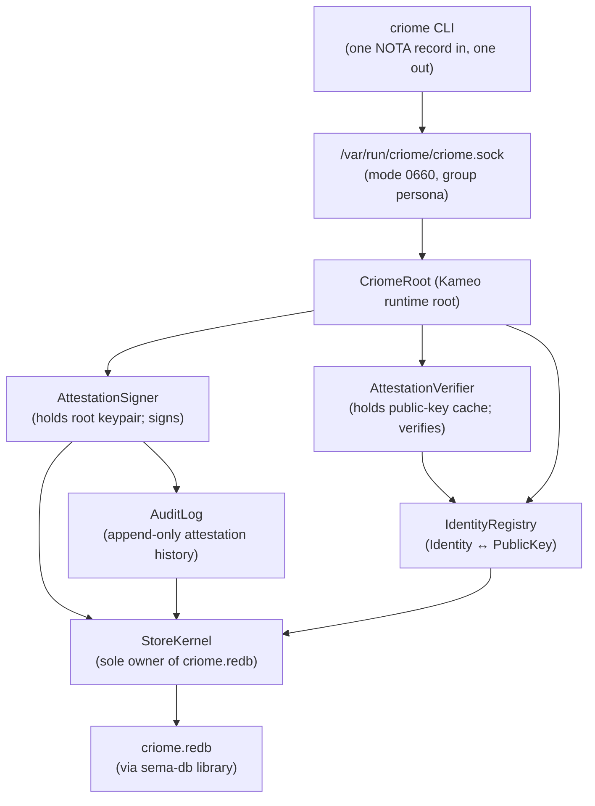

# criome — architecture

*Today's `criome` is a **minimal Spartan BLS-signature
authentication and attestation substrate** for the Persona
ecosystem. Identity registry, sign/verify primitives, and
typed attestations over channel grants, archive fingerprints,
authorization decisions, and privilege elevations.*

> **Scope: today, not eventually.** This document describes
> today's narrow `criome` daemon. The **eventual** `Criome`
> is the universal computing paradigm expressed in Sema —
> replacing Git, the editor, SSH, and the web; encompassing
> programming, version control, network identity, validation,
> and auth/security across the stack. Today's Spartan criome
> is one step toward that eventual shape, bringing forward
> the auth/identity slice. See
> `~/primary/ESSENCE.md` §"Today and eventually — different
> things, different names" and
> `~/primary/reports/designer/141-minimal-criome-bls-auth-substrate.md`.

> **Archaeology note.** Prior to this rewrite, today's
> `criome` was the sema-ecosystem records validator
> (Graph/Node/Edge/Derivation/CompiledBinary). That skeleton
> (validator pipeline, ractor supervision tree, sema-records
> tables) is preserved at commit **`a3f4173`**
> (`architecture: reframe marker as scope discipline …`).
> The sema-records validator function is **deferred to
> eventual Criome**; today's daemon does not carry it.

---

## 0 · TL;DR

- **One Kameo-based daemon** holding criome's own root BLS
  keypair, an identity registry, and an attestation audit
  log in `criome.redb` (via `sema-db`).
- **Three responsibilities**: **sign** content with
  criome's root key, **verify** signatures against
  registered identities, **register/lookup** typed
  identities (Persona, Agent, Host, Developer, Cluster).
- **Wire**: `signal-criome` contract crate (depends on
  `signal-core`, not on `signal`). Closed `CriomeRequest`
  / `CriomeReply` enums. One NOTA record in, one NOTA
  record out at the CLI boundary.
- **Out-of-band only.** Attestations live as separate
  records that reference content records (a
  `ChannelGrantAttestation` references a
  `signal-persona-mind::ChannelGrant`). Content records
  do not carry embedded proof fields; the
  `signal-persona-auth` discipline ("origin context, not
  proof material") stays inviolate.
- **Cluster-trust runtime functionality is folded in.**
  ClaviFaber's per-host `PublicKeyPublication` feeds into
  criome's identity registry, registering each host. This
  subsumes the cluster-trust-runtime placement work named
  in `~/primary/reports/designer/110-cluster-trust-runtime-placement.md`.

---

## 1 · Topology



Direct Kameo per `~/primary/skills/kameo.md`. `Self IS the
actor` everywhere. Blocking BLS operations (keypair load,
sign, verify) live in `AttestationSigner` /
`AttestationVerifier` via `DelegatedReply` + `spawn_blocking`
(Template 1 in `~/primary/skills/kameo.md` §"Blocking-plane
templates"), or on a dedicated thread (Template 2) when the
work is hot enough.

---

## 2 · Owned

- The `criome.redb` durable store and its mind-specific
  Sema-db layer.
- Criome's own root BLS keypair (loaded from
  `/etc/criome/root.key` at startup; private material
  mode 0600).
- The closed `Identity` enum vocabulary: `Persona`,
  `Agent`, `Host`, `Developer`, `Cluster`.
- The signing/verification API surface against `blst`.
- The attestation audit log (append-only,
  cryptographically witnessed).
- The `criome.pub` public-material publication for
  consumers to verify criome-issued attestations.

## 3 · Not owned

- Content records (`ChannelGrant`,
  `AuthorizationRequest`, `ArchiveAttestation`'s referent
  hash, `PrivilegeElevationRequest`) — those live in their
  respective `signal-persona-*` contract crates.
- Per-persona / per-agent / per-developer private
  keypairs — criome holds only the *public* halves.
- Audit-policy decisions about prompt safety — the
  persona-audit policy engine is a separate component to
  be designed in a follow-up report. Criome signs the
  *verdict*; the policy engine produces the verdict.
- Sema-ecosystem records validation (Graph/Node/Edge/
  Derivation/CompiledBinary) — deferred to eventual
  Criome.
- Effect-bearing dispatch (forge, arca-daemon, prism) —
  these belonged to the prior records-validator framing;
  they leave today's criome's surface.
- Key rotation orchestration — out of scope for the
  Spartan first cut.

---

## 4 · Wire vocabulary

The contract crate is `signal-criome` (separate repo, see
its own `ARCHITECTURE.md` when created). Closed enums:

```text
CriomeRequest
  | Sign(SignRequest)
  | VerifyAttestation(VerifyRequest)
  | RegisterIdentity(IdentityRegistration)
  | RevokeIdentity(IdentityRevocation)
  | LookupIdentity(IdentityLookup)
  | AttestArchive(ArchiveAttestationRequest)
  | AttestChannelGrant(ChannelGrantAttestationRequest)
  | AttestAuthorization(AuthorizationAttestationRequest)
  | SubscribeIdentityUpdates(IdentitySubscription)

CriomeReply
  | SignReceipt(SignReceipt)
  | VerificationResult(VerificationResult)
  | IdentityReceipt(IdentityReceipt)
  | IdentitySnapshot(IdentitySnapshot)
  | AttestationReceipt(AttestationReceipt)
  | IdentityUpdate(IdentityUpdate)
  | Rejection(Rejection)
```

Full request/reply per-variant shapes, the `Identity`
enum, and the `Attestation` record layout live in
`~/primary/reports/designer/141-minimal-criome-bls-auth-substrate.md`
§3–§4.

---

## 5 · State and ownership

Single redb file (`criome.redb`), opened only by
`StoreKernel`. Tables (named here; precise schema in
operator's implementation):

| Table | Key | Value |
|---|---|---|
| `identities` | `PublicKey` (BLS) | `Identity` (Persona / Agent / Host / Developer / Cluster) + metadata |
| `revocations` | `PublicKey` | revocation record + timestamp |
| `attestations` | `(SignerPubkey, IssuedAt)` | full `Attestation` record (audit trail) |
| `meta` | `()` | schema-version guard per `sema-db` discipline |

The version-skew guard runs at boot and hard-fails on
mismatch (per
`~/primary/skills/rust/storage-and-wire.md` §"Schema discipline").

---

## 6 · Trust model and key distribution

- Criome's root public key is materialized to
  `/etc/criome/root.pub` (mode 0644) at deploy time by
  the deployment chain. Every consumer (router,
  lojix-cli, forge) reads this file at startup to
  bootstrap signature verification.
- Per-persona / per-agent / per-developer / per-host
  identities are registered in criome via the
  `RegisterIdentity` request, which itself must be signed
  by an already-registered Developer identity (or, at
  cluster bootstrap, by criome's root). The registration
  message includes the new identity's public key.
- Public-key distribution to verifiers is **pushed** via
  `SubscribeIdentityUpdates` (per
  `~/primary/skills/push-not-pull.md`). Verifiers cache
  the current snapshot and apply deltas.
- Private keypair custody for other identities lives
  with those identities (personas hold their own;
  developers use HSMs or gpg-agent; etc.). Criome does
  not custody private keypairs other than its own root.

ClaviFaber feeds into criome via the same
`signal-clavifaber` channel named in
`~/primary/reports/designer/110-cluster-trust-runtime-placement.md`.
Each per-host `PublicKeyPublication` lands as a
`Identity::Host(HostName)` registration.

---

## 7 · Integration map

Detailed per-component integration lives in
`~/primary/reports/designer/141-minimal-criome-bls-auth-substrate.md`
§6. The headline boundaries:

| Component | Crosses to criome via | Purpose |
|---|---|---|
| `persona-mind` | `AttestChannelGrant`, `AttestAuthorization` | Mind requests attestations before forwarding decisions to router. |
| `persona-router` | `SubscribeIdentityUpdates`, `VerifyAttestation` | Router caches identity registry; verifies attestations before installing channels or delivering attested messages. |
| `persona` engine manager | `AttestAuthorization` (with `PrivilegeElevation` context) | Engine manager signs cross-engine route approvals and privilege-elevation verdicts. |
| `lojix-cli` | `AttestArchive`, `VerifyAttestation` | Build pipeline signs archive fingerprints; deploy pipeline verifies before activation. |
| ClaviFaber | `RegisterIdentity` (via `signal-clavifaber` feed) | Per-host publications register hosts in criome's identity registry. |
| Future `persona-audit` policy engine | `AttestAuthorization` (with audit verdict context) | Signed audit verdicts gate prompt delivery. |

---

## 8 · Constraints

Each load-bearing constraint becomes a witness test per
`~/primary/skills/architectural-truth-tests.md`. Test
seeds live in
`~/primary/reports/designer/141-minimal-criome-bls-auth-substrate.md`
§9. The headline constraints:

- The `criome` CLI accepts exactly one NOTA request
  record and prints exactly one NOTA reply record.
- The daemon owns `criome.redb`; the CLI never opens it.
- Signing requires a registered signer identity.
- Tampered or revoked or expired signatures fail
  verification with typed reasons.
- The verifier subscribes to identity updates (push, not
  poll).
- `signal-criome` does not depend on `signal` (the
  sema-ecosystem vocabulary).
- Content records (e.g., `ChannelGrant`) do not carry
  embedded proof fields; attestations live in separate
  records.
- Channel grants without a valid attestation do not
  install in router.
- Archive deployments without a valid attestation abort
  in lojix-cli.

---

## 9 · Code map

The current `src/` reflects the prior
sema-records-validator shape (commit `a3f4173`). It is
**due for full rewrite** per
`~/primary/reports/designer/141-minimal-criome-bls-auth-substrate.md`
§7. The target code map after operator's implementation
lands:

```text
src/lib.rs                 crate re-exports + module entry
src/main.rs                #[tokio::main] daemon entry
src/error.rs               typed Error enum (thiserror)
src/actors/root.rs         CriomeRoot Kameo runtime root
src/actors/signer.rs       AttestationSigner actor
src/actors/verifier.rs     AttestationVerifier actor
src/actors/registry.rs     IdentityRegistry actor
src/actors/store.rs        StoreKernel + criome.redb tables
src/text.rs                NOTA projection (one record in/out)
src/transport.rs           Unix-socket Signal-frame transport
src/command.rs             CLI client process-boundary logic
tests/*.rs                 round-trip + architectural-truth tests
```

Cargo dependencies after the rewrite: `signal-core`,
`signal-criome`, `kameo`, `sema-db`, `tokio`, `thiserror`,
`clap`, `rkyv`, `blst`, `blake3`, `nota-codec`,
`nota-derive`. **Drops** `signal`, `sema`, `ractor` (the
prior shape's deps).

---

## See also

- `~/primary/reports/designer/141-minimal-criome-bls-auth-substrate.md` —
  the design report this ARCH is the realization target of.
- `~/primary/ESSENCE.md` §"Today and eventually" — the
  scope discipline this ARCH applies.
- `~/primary/reports/designer/110-cluster-trust-runtime-placement.md` —
  partially superseded on the placement question;
  scope-discipline framing preserved.
- `~/primary/reports/designer/114-persona-vision-as-of-2026-05-11.md`
  §3.2 — eventual-Criome direction this Spartan today is
  one step toward.
- `~/primary/reports/designer/125-channel-choreography-and-trust-model.md` —
  channel grants today carry no proof; attestations
  attach here.
- `~/primary/skills/kameo.md` — the actor runtime.
- `~/primary/skills/actor-systems.md` — the actor
  discipline.
- `~/primary/skills/contract-repo.md` — `signal-criome` is
  a new contract crate.
- `~/primary/skills/architectural-truth-tests.md` —
  witnesses for §8.
- `~/primary/skills/push-not-pull.md` —
  `SubscribeIdentityUpdates` is push, not poll.
- `~/primary/skills/micro-components.md` — one
  capability, one crate, one repo.
- `/git/github.com/LiGoldragon/clavifaber/ARCHITECTURE.md`
  — feeds criome's identity registry; ClaviFaber's
  narrow per-host scope unchanged.
- This repo at commit `a3f4173` — archaeology of the
  prior sema-records-validator skeleton + ractor
  supervision tree + capability-token BLS-G1 stubs.
