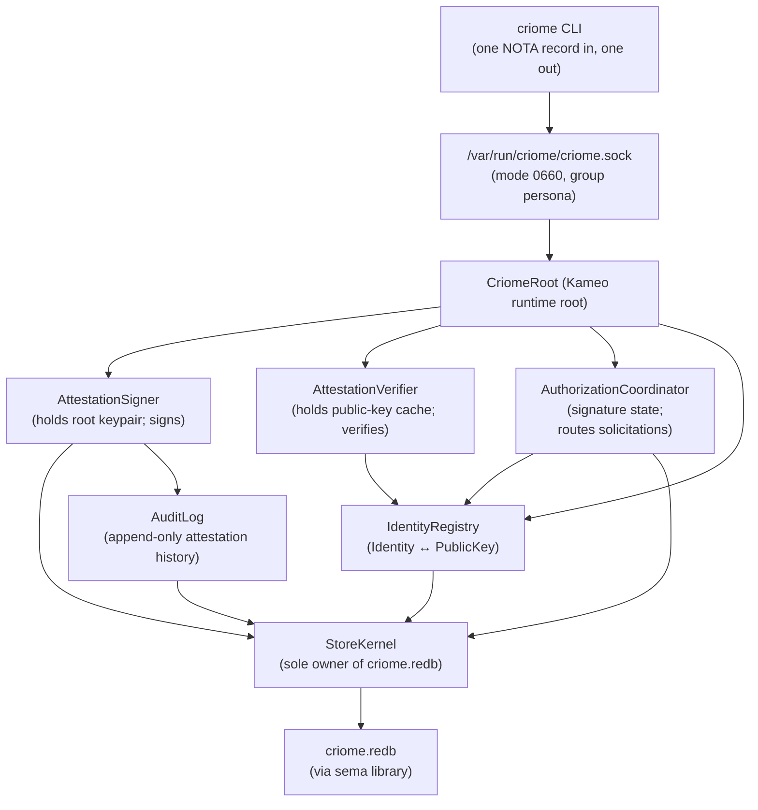

# criome — architecture

*Today's `criome` is a **minimal Spartan BLS-signature
authentication and attestation substrate** for the Persona
ecosystem. Identity registry, sign/verify primitives, and
typed attestations over channel grants, archive fingerprints,
authorization decisions, and privilege elevations.*

> **Scope: today, not eventually.** This document describes
> today's narrow `criome` daemon. The **eventual** `Criome`
> is the universal computing paradigm expressed in Sema —
> replacing Git, the editor, SSH, and the web; encompassing
> programming, version control, network identity, validation,
> and auth/security across the stack. Today's Spartan criome
> is one step toward that eventual shape, bringing forward
> the auth/identity slice. See
> `~/primary/ESSENCE.md` §"Today and eventually — different
> things, different names".

> **Archaeology note.** Prior to this rewrite, today's
> `criome` was the sema-ecosystem records validator
> (Graph/Node/Edge/Derivation/CompiledBinary). That skeleton
> (validator pipeline, ractor supervision tree, sema-records
> tables) is preserved at commit **`a3f4173`**
> (`architecture: reframe marker as scope discipline …`).
> The sema-records validator function is **deferred to
> eventual Criome**; today's daemon does not carry it.

---

## 0 · TL;DR

- **Operative principle**: **Criome verifies; Persona
  decides.** Criome answers *"is this signature valid for
  this principal under this grant for these bytes?"*
  Persona answers *"should this prompt be delivered,
  should this work be executed?"* The boundary is sharp;
  prompt-audit policy lives in `persona-mind`, not in
  criome.
- **One Kameo-based daemon** holding criome's own root
  keypair, an identity registry, delegation grants, a
  replay-guard, and an audit event log in `criome.redb`
  (via the `sema` library).
- **First milestone is verifier-shaped.** Three primary
  capabilities: **verify** external signatures (developer
  release signatures, persona-message signatures), **
  register/lookup** typed identities (Persona, Agent,
  Host, Developer, Cluster), **emit attestations** signed
  by criome's root key only when a witness requires (e.g.,
  ChannelGrantAttestation from `persona-mind`).
- **Routed authorization is the Lojix integration path.**
  `lojix-daemon` submits the exact canonical `signal-lojix`
  request digest to its local `criome-daemon`. Criome routes
  signature solicitations, records pending/granted/denied state,
  checks expiry and replay, and issues an authorization envelope
  whose permission comes from signatures over the exact request.
  Lojix owns deployment coordination after the envelope grants the
  requested scope.
- **Signature scheme**: **BLS12-381 from day one**, via
  `blst` (Supranational). Closed `SignatureScheme` enum
  carries `Bls12_381MinPk` and `Bls12_381MinSig` variants;
  operator picks one at implementation time per `blst`
  ergonomics. Committing to BLS at milestone one keeps
  every Spartan attestation a quorum candidate without a
  future scheme migration when eventual-Criome's
  quorum-signature multi-sig lands.
- **Wire**: `signal-criome` contract crate (depends on
  `signal-core`, not on `signal`). Closed `CriomeRequest`
  / `CriomeReply` enums. One NOTA record in, one NOTA
  record out at the CLI boundary.
- **Out-of-band only.** Attestations live as separate
  records that reference content records (a
  `ChannelGrantAttestation` references a
  `signal-persona-mind::ChannelGrant`). Content records
  do not carry embedded proof fields; the
  `signal-persona-auth` discipline ("origin context, not
  proof material") stays inviolate.
- **Cluster-trust runtime functionality is folded in.**
  ClaviFaber's per-host `PublicKeyPublication` feeds into
  criome's identity registry, registering each host.

---

## Authorization model

- `criome-daemon` receives routed authorization requests, routes
  signature solicitations, records submitted signatures, and issues an
  authorization grant when signatures authorize the exact request
  digest.
- Criome's authorization state is request state, signature
  solicitation state, submitted-signature state, grant state, expiry,
  and replay policy. The daemon does not own a local permission table
  that grants effects apart from signatures.
- Permission comes from signatures over the exact request digest. A
  grant for one request cannot authorize another request.
- `tui-criome` is a separate stateful TUI signing client. It speaks
  `signal-criome`, owns a local Sema database for request history,
  signing decisions, and signing-client key material, receives
  signature requests, submits signatures or rejections, and can create
  signed requests for Criome to route.
- `criome-daemon` keeps its own root keypair for criome-issued
  attestations. Signing-client private key custody belongs to the
  signing client, not to the daemon.
- Lojix effects wait for `AuthorizationGranted`. Pending
  authorization state is observed through `ObserveAuthorization`, not
  by polling.

## 1 · Topology



Direct Kameo per `~/primary/skills/kameo.md`. `Self IS the
actor` everywhere. Blocking BLS operations (keypair load,
sign, verify) live in `AttestationSigner` /
`AttestationVerifier` via `DelegatedReply` + `spawn_blocking`
(Template 1 in `~/primary/skills/kameo.md` §"Blocking-plane
templates"), or on a dedicated thread (Template 2) when the
work is hot enough.

---

## 2 · Owned

- The `criome.redb` durable store and its component-local
  Sema layer.
- Criome's own root BLS keypair (loaded from
  `/etc/criome/root.key` at startup; private material
  mode 0600).
- The closed `Identity` enum vocabulary: `Persona`,
  `Agent`, `Host`, `Developer`, `Cluster`.
- The signing/verification API surface against `blst`.
- The attestation audit log (append-only,
  cryptographically witnessed).
- The `criome.pub` public-material publication for
  consumers to verify criome-issued attestations.
- Authorization request state, signature solicitation state,
  submitted signature state, authorization envelope issuance,
  authorization expiry, and replay policy. Criome's authorization
  permission comes from signatures over exact requests.

## 3 · Not owned

- Content records (`ChannelGrant`,
  `AuthorizationRequest`, `ArchiveAttestation`'s referent
  hash, `PrivilegeElevationRequest`) — those live in their
  respective `signal-persona-*` contract crates.
- Per-persona / per-agent / per-developer private
  keypairs — criome holds only the *public* halves.
- Audit-policy decisions about prompt safety — the
  persona-audit policy engine is a separate component to
  be designed in a follow-up report. Criome signs the
  *verdict*; the policy engine produces the verdict.
- Sema-ecosystem records validation (Graph/Node/Edge/
  Derivation/CompiledBinary) — deferred to eventual
  Criome.
- Effect-bearing dispatch (forge, arca-daemon, prism) —
  these belonged to the prior records-validator framing;
  they leave today's criome's surface.
- Key rotation orchestration — out of scope for the
  Spartan first cut.

---

## 4 · Wire vocabulary

The contract crate is `signal-criome` (separate repo, see
its own `ARCHITECTURE.md` when created). Closed enums:

```text
CriomeRequest
  | Sign(SignRequest)
  | VerifyAttestation(VerifyRequest)
  | RegisterIdentity(IdentityRegistration)
  | RevokeIdentity(IdentityRevocation)
  | LookupIdentity(IdentityLookup)
  | AttestArchive(ArchiveAttestationRequest)
  | AttestChannelGrant(ChannelGrantAttestationRequest)
  | AttestAuthorization(AuthorizationAttestationRequest)
  | SubscribeIdentityUpdates(IdentitySubscription)

CriomeReply
  | SignReceipt(SignReceipt)
  | VerificationResult(VerificationResult)
  | IdentityReceipt(IdentityReceipt)
  | IdentitySnapshot(IdentitySnapshot)
  | AttestationReceipt(AttestationReceipt)
  | IdentityUpdate(IdentityUpdate)
  | Rejection(Rejection)
```

---

## 5 · State and ownership

Single redb file (`criome.redb`), opened only by
`StoreKernel`. Tables (named here; precise schema in
operator's implementation):

| Table | Key | Value |
|---|---|---|
| `identities` | typed identity key | `StoredIdentity` with public key, fingerprint, purpose, status |
| `revocations` | typed identity key | `StoredRevocation` |
| `attestations` | monotonic slot | `StoredAttestation` |
| `authorization_requests` | typed authorization request slot | pending/granted/denied authorization state |
| `signature_solicitations` | typed authorization request slot + signer | in-flight routed signature work |
| `submitted_signatures` | typed authorization request slot + signer | signatures submitted by `tui-criome` or peer signing clients |
| `attestation_next_slot` | singleton key | next monotonic slot |
| Sema meta | Sema-owned | schema-version and rkyv-format guards |

The version-skew guard runs at boot and hard-fails on
mismatch (per
`~/primary/skills/rust/storage-and-wire.md` §"Schema discipline").

---

## 6 · Trust model and key distribution

- Criome's root public key is materialized to
  `/etc/criome/root.pub` (mode 0644) at deploy time by
  the deployment chain. Every consumer (router,
  lojix-cli, forge) reads this file at startup to
  bootstrap signature verification.
- Per-persona / per-agent / per-developer / per-host
  identities are registered in criome via the
  `RegisterIdentity` request, which itself must be signed
  by an already-registered Developer identity (or, at
  cluster bootstrap, by criome's root). The registration
  message includes the new identity's public key.
- Public-key distribution to verifiers is **pushed** via
  `SubscribeIdentityUpdates` (per
  `~/primary/skills/push-not-pull.md`). Verifiers cache
  the current snapshot and apply deltas.
- Private keypair custody for other identities lives
  with those identities (personas hold their own;
  developers use HSMs or gpg-agent; etc.). Criome does
  not custody private keypairs other than its own root.

ClaviFaber feeds into criome via a `signal-clavifaber` channel.
Each per-host `PublicKeyPublication` lands as a
`Identity::Host(HostName)` registration.

---

## 7 · Integration map

The headline boundaries:

| Component | Crosses to criome via | Purpose |
|---|---|---|
| `persona-mind` | `AttestChannelGrant`, `AttestAuthorization` | Mind requests attestations before forwarding decisions to router. |
| `persona-router` | `SubscribeIdentityUpdates`, `VerifyAttestation` | Router caches identity registry; verifies attestations before installing channels or delivering attested messages. |
| `persona` engine manager | `AttestAuthorization` (with `PrivilegeElevation` context) | Engine manager signs cross-engine route approvals and privilege-elevation verdicts. |
| `lojix-cli` | `AttestArchive`, `VerifyAttestation` | Build pipeline signs archive fingerprints; deploy pipeline verifies before activation. |
| `lojix-daemon` | `AuthorizeSignalCall`, `ObserveAuthorization`, `VerifyAuthorization` | Daemon submits an exact `signal-lojix` request digest, waits for pending signature state or an authorization grant, and verifies grants before local deploy effects. |
| `tui-criome` | `ObserveAuthorization`, `SubmitSignature`, `RejectAuthorization`, `AuthorizeSignalCall` | Stateful TUI signing client with its own Sema database for request history and key material. Receives signature requests, submits signatures, rejects requests, and can create signed requests for Criome. |
| ClaviFaber | `RegisterIdentity` (via `signal-clavifaber` feed) | Per-host publications register hosts in criome's identity registry. |
| Future `persona-audit` policy engine | `AttestAuthorization` (with audit verdict context) | Signed audit verdicts gate prompt delivery. |

---

## 8 · Constraints

Each load-bearing constraint becomes a witness test per
`~/primary/skills/architectural-truth-tests.md`. The headline
constraints:

- The `criome` CLI accepts exactly one NOTA request
  record and prints exactly one NOTA reply record.
- The daemon owns `criome.redb`; the CLI never opens it.
- Signed payloads carry **domain separation** — every
  signature binds a content hash to its purpose
  (component name, channel role, audience, contract/
  schema version, expiry). A release signature cannot
  verify as a persona-message authorization.
- One-shot delegations and time-bound authorizations are
  protected by a `replay_guard` table; repeat use of the
  same `(principal, audience, nonce)` rejects with
  typed `ReplayAttempted`.
- Tampered, revoked, expired, or replayed signatures
  fail verification with typed reasons.
- The verifier subscribes to identity updates (push, not
  poll).
- `signal-criome` does not depend on `signal` (the
  sema-ecosystem vocabulary).
- Content records (e.g., `ChannelGrant`) do not carry
  embedded proof fields; attestations live in separate
  records.
- Channel grants without a valid attestation do not
  install in router.
- Archive deployments without a valid attestation abort
  in lojix-cli.
- Lojix deploy effects do not begin until `AuthorizeSignalCall`
  returns `AuthorizationGranted` for the exact request digest and
  requested scope.
- Authorization permission comes from signatures over the exact
  request.
- Pending authorization is a first-class state. It is
  observed through `ObserveAuthorization`, not by polling.
- An authorization grant for request A cannot authorize
  request B; `VerifyAuthorization` checks the typed
  digest match.
- Prompt-audit policy code does not live in this repo
  (it belongs to `persona-mind`).

---

## 9 · Code map

The current `src/` is the first Kameo daemon skeleton for
the Spartan BLS-auth substrate:

```text
src/lib.rs                 crate re-exports + module entry
src/main.rs                CLI/daemon entry
src/error.rs               typed Error enum (thiserror)
src/actors/root.rs         CriomeRoot Kameo runtime root
src/actors/signer.rs       AttestationSigner actor
src/actors/verifier.rs     AttestationVerifier actor
src/actors/registry.rs     IdentityRegistry actor
src/actors/store.rs        StoreKernel + criome.redb tables
src/tables.rs              component-local Sema tables
src/text.rs                Nexus/NOTA projection (one record in/out)
src/transport.rs           Unix-socket Signal-frame transport
src/command.rs             CLI client process-boundary logic
src/daemon.rs              Unix-socket daemon wrapper around CriomeRoot
tests/*.rs                 round-trip + architectural-truth tests
```

Cargo dependencies after the rewrite: `signal-core`,
`signal-criome`, `kameo`, `sema`, `tokio`, `thiserror`,
`clap`, `rkyv`, `blst`, `blake3`, `nota-codec`.
**Drops** the retired `signal` and `ractor` dependencies.

Current implementation status:

- `RegisterIdentity`, `LookupIdentity`, `RevokeIdentity`,
  and `SubscribeIdentityUpdates` route through the Kameo
  actor tree and the component-local Sema store.
- `Sign` and attestation requests require a registered
  signer and persist a typed attestation record, but the
  signature string is still a skeleton placeholder. The
  real `blst` key-loading/signing path is the next
  cryptographic milestone.
- `VerifyAttestation` checks content equality, known
  signer, revocation, and public-key match, then reports
  `InvalidSignature` until real BLS verification lands.
- Routed authorization types are now present in `signal-criome`.
  The daemon implementation still needs the
  `AuthorizationCoordinator`, signature solicitation/submission Sema
  tables, and fake-Criome tests proving Lojix effects cannot start
  before an `AuthorizationGranted` envelope. `tui-criome` is a new
  stateful signing-client component, not part of this daemon repo.

---

## See also

- `~/primary/ESSENCE.md` §"Today and eventually" — the
  scope discipline this ARCH applies.
- `~/primary/skills/kameo.md` — the actor runtime.
- `~/primary/skills/actor-systems.md` — the actor
  discipline.
- `~/primary/skills/contract-repo.md` — `signal-criome` is
  a new contract crate.
- `~/primary/skills/architectural-truth-tests.md` —
  witnesses for §8.
- `~/primary/skills/push-not-pull.md` —
  `SubscribeIdentityUpdates` is push, not poll.
- `~/primary/skills/micro-components.md` — one
  capability, one crate, one repo.
- `/git/github.com/LiGoldragon/clavifaber/ARCHITECTURE.md`
  — feeds criome's identity registry; ClaviFaber's
  narrow per-host scope unchanged.
- This repo at commit `a3f4173` — archaeology of the
  prior sema-records-validator skeleton + ractor
  supervision tree + capability-token BLS-G1 stubs.
